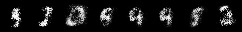
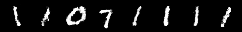

# GAN_Zoo
## Raw_GAN

```bash
cd gan/
bash exp.sh
```

- data_set = MNIST
- num_epoch = 1000
- batch_size = 64
- latent_dim = 100

|       before        |        after        |
| :-----------------: | :-----------------: |
|  |  |

